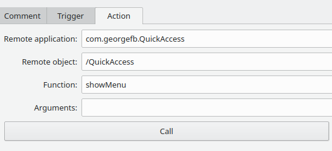

**QuickAccess** is a program providing a menu to quickly access user defined folders and their subfolders.
The menu can be opened through dbus.

# Example

toggle menu with qdbus

```
qdbus com.georgefb.QuickAccess /QuickAccess showMenu
```

[KDE Plasma shortcut:](https://docs.kde.org/trunk5/en/kde-workspace/kcontrol/khotkeys/shortcuts.html)



# Dependencies
- Extra CMake Modules
- Qt5 Widgets
- Qt5 DBus
- KF5 I18n
- KF5 Config

Install dependencies:

- **Ubuntu** `sudo apt install build-essential cmake extra-cmake-modules qtbase5-dev libkf5config-dev libkf5i18n-dev`
- **Solus** `sudo eopkg it -c system.devel extra-cmake-modules qt5-base-devel kconfig-devel ki18n-devel`

# Build

```
cd /path/to/quickaccess_project
mkdir build && cd build
cmake ..
make
./quickaccess
```


